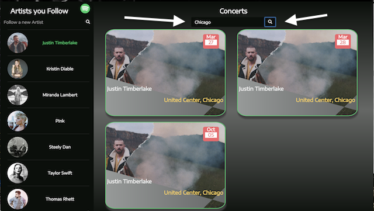
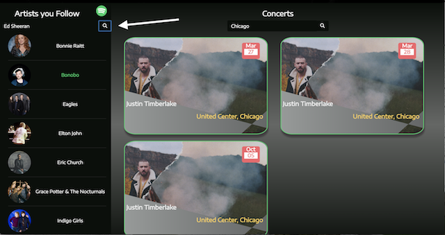
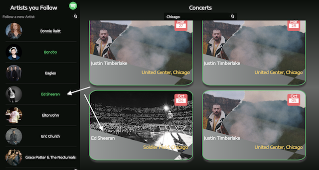

# SpotYourShow
    
<https://codisteinborn.github.io/ConcertApp/> \
Version 1.0 \
Original Deployment Date - February 16, 2018
    

# The Idea:

Joe was tired of finding out that his favorite bands had performed just a few miles away AFTER the roadies had already packed up and moved on. 

He conceived of a single application where the artists followed on Spotify could be integrated with real-time concert information provided on the Ticketmaster website. From that idea, SpotYourShow was born.

# Getting Started:

Software Installation - SpotYourShow does not reqire any software installation to operate.
    
Prerequisites - An account with Spotify ( <https://www.spotify.com/us/> ). If you do not have a Spotify account, you will be given the opportunity to sign up for one during the SpotYourShow login process. 

# Users Guide:

Application Link - <https://codisteinborn.github.io/ConcertApp/>

Instructions - 

Login:  Click the Login button to authorize SpotYourShow to access your Spotify account data.  If you do not have a Spotify account, you will be allowed to create one at this time.

Carousel Picture:

Although it is a shame to move quickly past this very cool carousel/jumbotron, just click on the green down-arrow to get to the list of artists that you follow.

Followed Artists from Spotify:

If you are a Spotify veteran, you likely have a list of Artists that you follow. That list will automatically download to on the left side of the page. Click on one artist's name or several and watch the magic happen.

Concert Information  - Worldwide or by City:

If the artist you clicked on has a concert in the Ticketmaster system,a picture will appear in the right hand side of the screen sorted by date.

                
If you want to see this information for your city, or a place you would like to visit, type the name in the 'Search by City' box and click the magnifying glass. 

Get your Tickets!:

Find a show that you would like to see, just click on one of the concert pictures and you will be directed to Ticktmaster where you buy tickets!!

Add an Artist:

If you think of a new artist that you would like to follow, just type the name into the 'Follow a new Artist' search box and click the button. Not only will the new artist be added to this list on this page, they will be uploaded to your 'Follow' list in Spotify.

You can clear out the rendered concerts by clicking on the individual artists that are hilighted in green OR by clicking on the trash can at the bottom of the "Artist you Follow" list.

This will only clear out your concert search. I it will NOT remove artists from Spotify.

That is all there is too it!  Enjoy playing around with this site. Better yet, enjoy the show!!
                
# Built Utilizing:

Bootstrap v3 - <http://getbootstrap.com/docs/3.3/> \
Moment.js - <https://momentjs.com/> \
Spotify API - <https://developer.spotify.com/web-api/> \
Ticketmaster Developer API - <https://developer.ticketmaster.com/>

# Original Contributors:

Joe Fitzpatrick - <https://github.com/joefitz12> \
Codi Steinborn  - <https://github.com/codisteinborn/> \
Susan Lippa - <https://github.com/slippa91>

# Ideas for Improvement:

Have an idea for improving this site? Please first discuss the change you wish to make via email with the owners of this repository. Email addresses can be found on the contributor's gitHub pages (links above).

# SpotYourShow in Development:

UserStories:

As a user, I want to get a list of artists I follow on my Spotify account so that I can see which artists I like

As a user, I want to see concerts in a specific area so that I can see which shows are coming up there

As a user, I want to choose a concert so that I can find tickets to that show

As a user, I want to be able to see all shows of a specific artist so that I can view all upcoming dates/locations for their shows

As a user, I want to create a list of favorites so that I can prioritize which shows I'm most interested in attending

As a user, I want to see which of my friends follow an artist that I also follow so that I can see if they want to come to the concert with me

Original WireFrame:

Future Development:

For shows with multiple selected artists, render a single concert picture with "Multiple Artists" displayed in name space.

Using local storage to keep a list of favorite concerts with a reminder triggered when tickets go on sale.

Adding music snippets from the artist when they are selected.

Incorporate a Google Map integration for venues when single a single city is selected.

